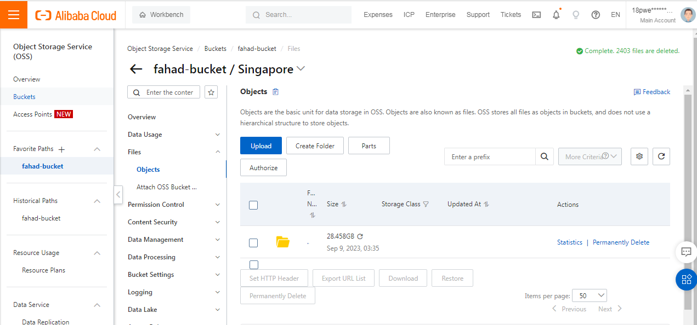
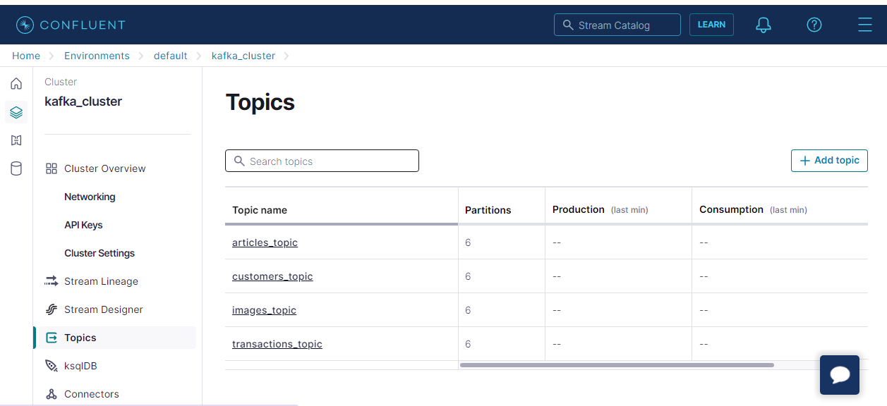
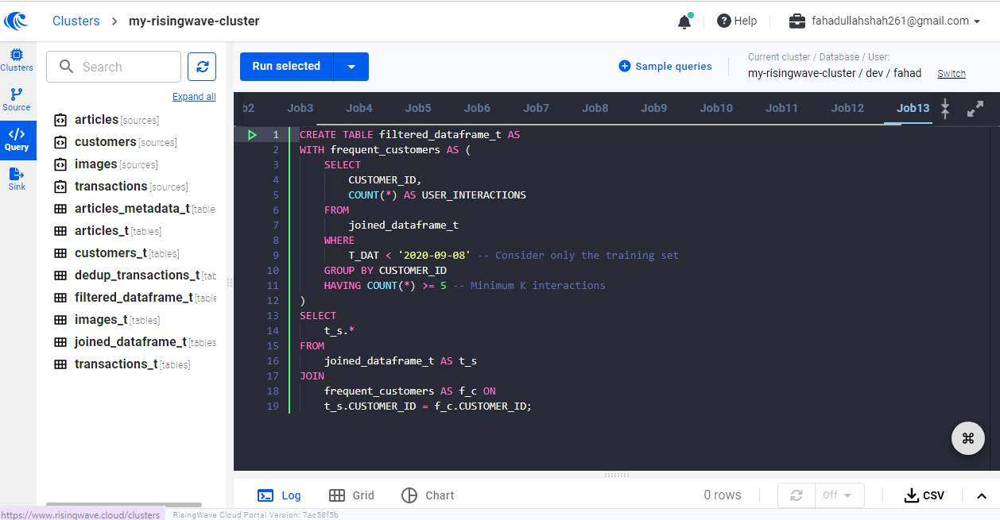

# Real-time Recommender System using RisingWave and Kafka
This project showcases RisingWave's application in recommender systems, including data transformation and preprocessing, data streaming using Kafka, and model training through Metaflow, Comet ML, and Merlin framework, visualizing recommendations with Streamlit.
## Project Overview
This project demonstrates a real-world application of RisingWave, a distributed streaming platform, within the realm of recommender systems, in particular, and machine learning in general. It begins with a fashion-products recommendation company that tailors recommendations to its customers based on a rich dataset encompassing customers’ information, product data, and transaction history. This real-time data is supposedly sourced directly from the company's platform and seamlessly streamed into Kafka, which serves as the streaming platform with various Kafka topics that store all this data. 

Subsequently, all this data is sent to the RisingWave Cloud platform where it undergoes rigorous transformations and feature engineering using SQL. Thus, all the preprocessing tasks are executed within the Risingwave Cloud environment. 
Metaflow is used to orchestrate and manage the machine learning workflows. Additionally, Comet ML provides support for tracking experiments across various recommender models based on different sets of hyperparameters, helping us visualize the project's machine learning lifecycle.

The project leverages the Merlin framework from NVIDIA for data preparation and recommender model training. This powerful framework streamlines the whole process and ensures efficient model training. Once the recommender model has been trained, validated, and rigorously tested, Streamlit is employed to create a user interface, thus allowing us to visualize the recommendations generated by the recommender model.
## Prerequisites 
This self-contained project requires the following for implementation:

1. [Alibaba Cloud](https://www.alibabacloud.com/free) or [AWS Account](https://aws.amazon.com/free/): You can sign up for a free Alibaba Cloud or AWS account to host product images and compute resources.

2. [Confluent Cloud Account](https://www.confluent.io/confluent-cloud/tryfree/): Sign up for a free Confluent Cloud account to access Kafka services.

3. [RisingWave Cloud Account](https://www.risingwave.com/cloud/): Register for a free RisingWave Cloud account.

4. [Comet ML Account](https://www.comet.com/site/pricing/): Sign up for a free Comet ML account to track the machine learning lifecycle.
## Setup
We recommend `Python 3.10` for this project.
Create a virtual environment for dependency isolation. 
Create a local.env file and fill its values as:
| VARIABLE | TYPE (DEFAULT) | MEANING |
| ------------- | ------------- | ------------- |
| BOOTSTRAP SERVER | string  | Kafka broker’s address  |
| API KEY | string |  API key for Confluent Cloud  |
| SECRET KEY | string  |  API secret key for Confluent Cloud   |
| CONNECTION STRING | string |  Connection string to connect with Risingwave Cloud   |
| COMET_API_KEY | string  | Comet ML API key  |
| EXPORT_TO_APP | 0-1 (0)  | Enable exporting predictions for inspections through Streamlit |
### Upload data to Kafka
The dataset from [H&M Personalized Fashion Recommendation Kaggle Challenge](https://www.kaggle.com/competitions/h-and-m-personalized-fashion-recommendations) is used.
*  Download the complete dataset and store it in the `data` directory such as `articles.csv`, `customers.csv`,`transactions.csv`, while uploading the downloaded images to cloud storage and create a file `url_of_images` as given in the `data` directory.
 
* Create four topics in Confluent Cloud with default settings such as `articles_topic`, `customers_topic`, `images_topic`, and `transactions_topic`.
* cd to `kafka` directory and run the `producer.py` to upload all the data to the corresponding Kafka topics.

### Ingesting Data from Confluent Cloud into RisingWave Cloud
Create the following  Sources in Risingwave Cloud based on the corresponding SQL scripts in the `risingwave` directory:

`articles` using `articles_source.sql`

`customers`  using `customers_source.sql`

`images` using `images_source.sql`

`transactions` using `transactions_source.sql`

Create the following tables in RisingWave Cloud based on the corresponding SQL scripts in `risingwave` directory:

`articles_t` using `articles_table.sql`

`customers_t`  using `customers_table.sql`

`images_t` using `images_table.sql`

`transactions_t` using `transactions_table.sql`

`articles_metadata_t` using `articles_metadata_table.sql`

`dedup_transactions_t` using `dedup_transactions_table.sql`

`joined_transactions_t` using `joined_transactions_table.sql`

`filtered_dataframe_t` using `filtered_dataframe_table.sql`

## Run the Entire Project
Change the directory to the `recsys` directory and execute the following commands:

`python my_merlin_flow.py` To view the overall Metaflow workflow

`python my_merlin_flow.py run` To execute the overall workflow

After completing the Metaflow workflow, change the directory to the `streamlit` directory and run the following command:

`Streamlit run pred_inspector.py` This will launch a Streamlit-based website to visualize recommendations generated by the recommender model.

Finally, visit [Comet ML Account](https://www.comet.com/site/pricing/) to access comprehensive results of the machine learning lifecycle, including various hyperparameters and corresponding metrics like model accuracy and its loss and for model tracking.

## Acknowledgments:
This project could not have been completed without the help of the following:

[Jacopo Tagliabue](https://www.linkedin.com/in/jacopotagliabue), and his [recs-at-resonable-scale](https://github.com/jacopotagliabue/recs-at-resonable-scale) provide a template for the project.

[Stanislav Koslovsky](https://es.linkedin.com/in/stanislavkozlovski), a staff engineer at Confluent, helped me in dealing with Confluent Cloud.

`RisingWave Team`, helped me in performing various tasks as well as providing compute resources in RisingWave Cloud.
